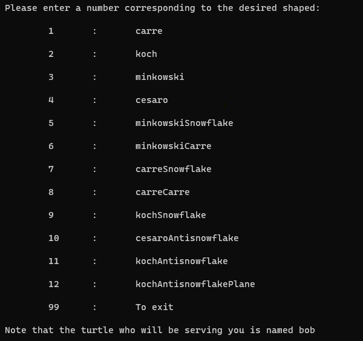
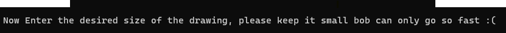

# Python-turtle-fractals
Python fractals using turtle
# How to use
## CLI
Can be run using ```
python koch.py [sizeOfFractal] [1-12] [1-12]...```
where [1-12] represents the index of the fractral that is desired. (Look at I/O section to see which index maps
to which fractal)
## I/O
-Just run ```
python koch.py``` to get a I/O interface
-You will first be prompted to select the desired fractal (or enter 99 to stop)

-Then you will be prompted to select the size (preferably around 300 ish, bigger drawings take much longer)
 
-Once the drawing is done, you will be prompted again to select a desired fractal
# Hope you like it!!
